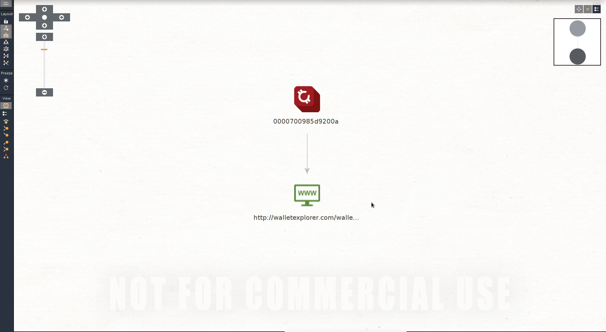
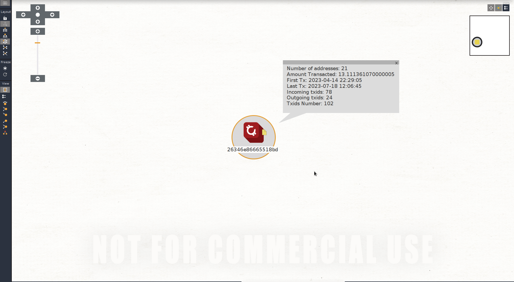

# CryptoSearch Project

CryptoSearch represents a comprehensive suite of Maltego transforms tailored for in-depth cryptocurrency analysis. Utilizing the powerful APIs from Ales Janda's WalletExplorer.Com Clustering and Arkham Intelligence Platforms Labeling, CryptoSearch facilitates extensive examination and tracking of Bitcoin blockchain activity. Seamlessly integrated into the Maltego application, CryptoSearch enhances the ability to visualize complex data, perform deep link analysis, and generate detailed investigative reports, making it an invaluable tool for uncovering insights and tracking illicit activities on the blockchain.


## Key Features

- **Flexible Execution**: Run transforms locally or through the Maltego Transform Distribution Server (TDS) for seamless integration.
- **Advanced Analysis**: Utilize WalletExplorer.Com's address clustering to gain insights into the relationships between addresses.
- **Detailed Insights**: Obtain outgoing addresses, stats, and labels for addresses and clusters, providing a clear picture of blockchain activity.
- **Illicit Activity Tracking**: Identify and track suspicious or illicit activities on the Bitcoin blockchain, aiding in investigative efforts.
- **Visualization and Reporting**: Use Maltego's visualization tools to create detailed graphs and export them for comprehensive reports.

## Applications

- **Blockchain Forensics**: Investigate and map out complex transaction patterns to identify potential fraudulent activities.
- **Crypto Compliance**: Ensure regulatory compliance by monitoring and reporting on cryptocurrency transactions.
- **Research and Analysis**: Conduct in-depth research on blockchain activities to uncover trends and insights.

## Implementation

To implement CryptoSearch, follow these steps:

1. **Obtain API Keys:**
   - Get an API key from [WalletExplorer](https://www.walletexplorer.com/info).
   - Obtain another API key from [Arkham Intelligence](https://codex.arkhamintelligence.com/arkham-api).
   - Copy and paste these API keys into `config.json` and place it in your `project_name/`.

2.  **Local Installation Steps:**
   - Install the required micromodule with `pip3 install maltego-trx`.
   - Create a new project directory: `mkdir project_name`.
   - Navigate into the project directory: `cd project_name`.
   - Start the project setup: `maltego-trx start project_name`.
   - Delete the `transforms` folder inside your project.
   - Copy the `transforms/` and `apis/` folders from `src` into `project_name/`.
   - Verify the setup by running `python project.py list` to see a list of local transform names.
   - For further instruction, follow the [Maltego Python Transform Server setup guide](https://docs.maltego.com/support/solutions/articles/15000015758-writing-transforms).

3. **Append Custom Entities in maltego-trx `entities.py`:**
   - Execute the following command to append the new custom entities in the `entities.py` file of the `maltego-trx` micromodule.
     
     ```while read -r line; do echo "$line" >> $(pip3 show maltego-trx | grep Location | awk '{print $2}')/maltego_trx/entities.py; done << project_name/enities.txt```

     or copy paste the context of entities.txt into entities.py of maltego_trx python module.
     
5. **Configure Maltego:**
   - Open Maltego, go to the **Entities** tab, and select **Import Entities**.
   - Locate and import `entities_icons.mtz`.
   - Navigate to the **Transforms** tab and manually add each transform:
     - Example for transform `ToAddressesOfCluster.py`:
       - **Display Name**: To Addresses Of Cluster (or custom name)
       - **Description**: Provide a brief description
       - **TransformID**: **maltego**.(custom-id)
       - **InputEntityType**: BitcoinAddress
       - **Command**: Path to your Python3 executable (which python3)
       - **Parameters**: Select `project_path/project.py` and then append `local toaddressesofcluster`
       - **Working directory**: Select your project directory
       - **Finish**

6. **Setting up TDS/ITDS:**
   - Refer to the [tutorial for TDS](https://docs.maltego.com/support/solutions/articles/15000017584-setup-python-transform-server-using-trx-gunicorn#start-a-new-project-0-1) for detailed instructions.


7. **Transform Description**

- **toaddressdataasentities: ToAddressDataAsEntities**
  
  - **Input**: BTC Address
  - **Output**: Returns stats (first-last transaction time, number of transactions, incoming, outgoing, etc.) of the Bitcoin address as entities.

- **toaddressdatawe: ToAddressDataWE**
  
  - **Input**: BTC Address
  - **Output**: Returns stats (first-last transaction time, number of transactions, incoming, outgoing, etc.) of the Bitcoin address as Notes in the current entity.

- **toaddressesofcluster: ToAddressesOfCluster**
  
  - **Input**: BTC Cluster
  - **Output**: Returns links with all addresses of a WalletExplorer cluster. (Maltego Community supports only 12 results per query)

- **toclusterdataasentities: ToClusterDataAsEntities**
  
  - **Input**: BTC Cluster
  - **Output**: Returns stats (first-last transaction time, number of transactions, number incoming, number outgoing, etc.) of the WalletExplorer Bitcoin cluster as new entities.

- **toclusterdatanotes: ToClusterDataNotes**
  
  - **Input**: BTC Cluster
  - **Output**: Returns stats (first-last transaction time, number of transactions, number incoming, number outgoing, etc.) of the WalletExplorer Bitcoin cluster as Notes in the current entity.

- **toclusterlabelwe: ToClusterLabelWE**
  
  - **Input**: BTC Cluster
  - **Output**: Returns label of the current cluster, if it exists.

- **tolabelsarkham: ToLabelsArkham**
  
  - **Input**: BTC Address
  - **Output**: Returns label of the current address, if it exists.

- **tooutboundaddress: ToOutboundAddress**
  
  - **Input**: BTC Address
  - **Output**: Returns outgoing Bitcoin addresses and current cluster.

- **tooutboundclusterswe: ToOutboundClustersWE**
  
  - **Input**: BTC Cluster
  - **Output**: Returns outgoing WalletExplorer clusters.

- **totop5addressesofcluster: ToTop5AddressesOfCluster**
  
  - **Input**: BTC Cluster
  - **Output**: Returns the top 5 addresses of the current cluster, with the most transactions or remaining balance.
    
- **tocurrentcluster: ToCurrentCluster**
  
  - **Input**: BTC Address
  - **Output**: Returns only the current cluster.

**Screenshots**


### Special Thanks

Special thanks to Ales Janda, creator of WalletExplorer, as well as the Arkham Intelligence group for their valuable contributions and APIs.

CryptoSearch is an indispensable tool for professionals in cybersecurity, finance, and law enforcement, providing the tools necessary for in-depth blockchain analysis and reporting.

